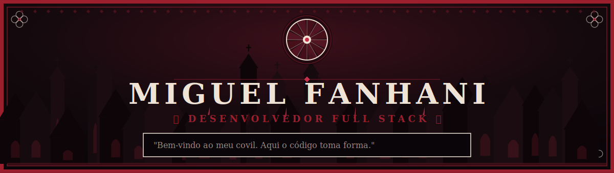

 

 

 

## ⚜ SOBRE

Sou **Miguel Fanhani**, de Catanduva/SP. Curso **ADS** no IFSP e **Engenharia de
Software** na Estácio, ao mesmo tempo — e ainda encaixo tudo isso numa escala de
trabalho 5x1. Tempo é o recurso mais raro que eu tenho, então cada linha de código
que escrevo tenta valer a pena.

Gosto de construir coisas que carregam um mundo próprio — não só uma funcionalidade,
mas uma identidade. Rock, bandas, universos de fantasia: se o projeto tem alma, eu
me interesso mais em fazer direito.

 

 

## 🩸 PROJETO EM DESTAQUE

### Deadwax

*Catálogo de bandas e álbuns onde as pessoas postam suas músicas favoritas e avaliam
publicamente.*

Construído em **Java 17 + Spring Boot**, com **Spring Data JPA** (relacionamentos
entre banda, álbum e avaliação), front-end em **Thymeleaf** e banco **H2** persistente.
Identidade visual desenhada do zero — nada de template pronto.

  

 

 

## ⚔ ARSENAL

 

 

## 🕯 ATIVIDADE

 

 

## ✦ CONTATO

  

<i>"Bem-vindo ao meu covil. Aqui o código toma forma."</i>
 
MIGUEL FANHANI © 2026

